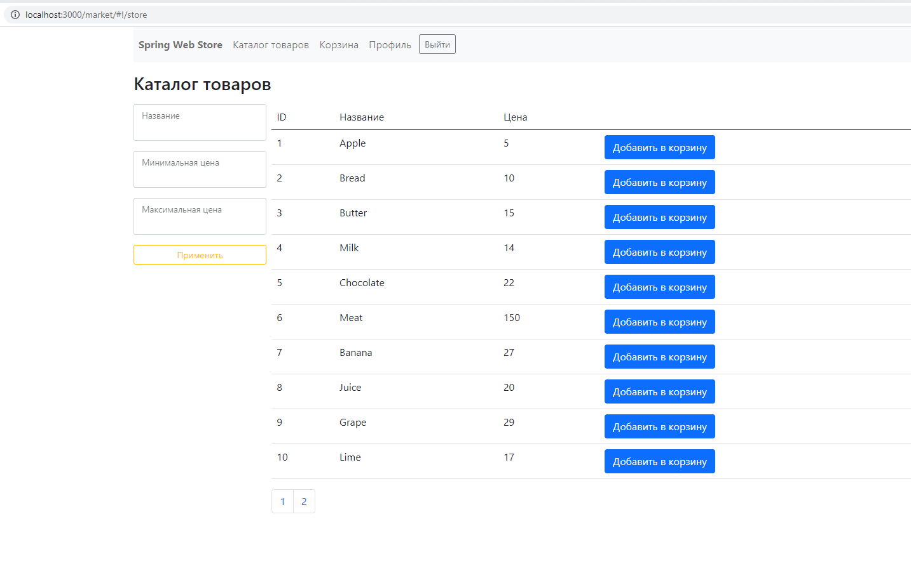
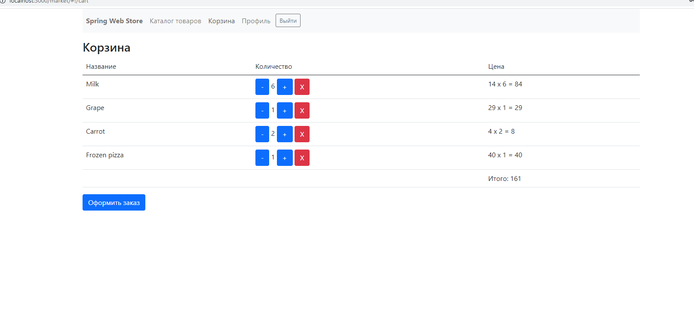
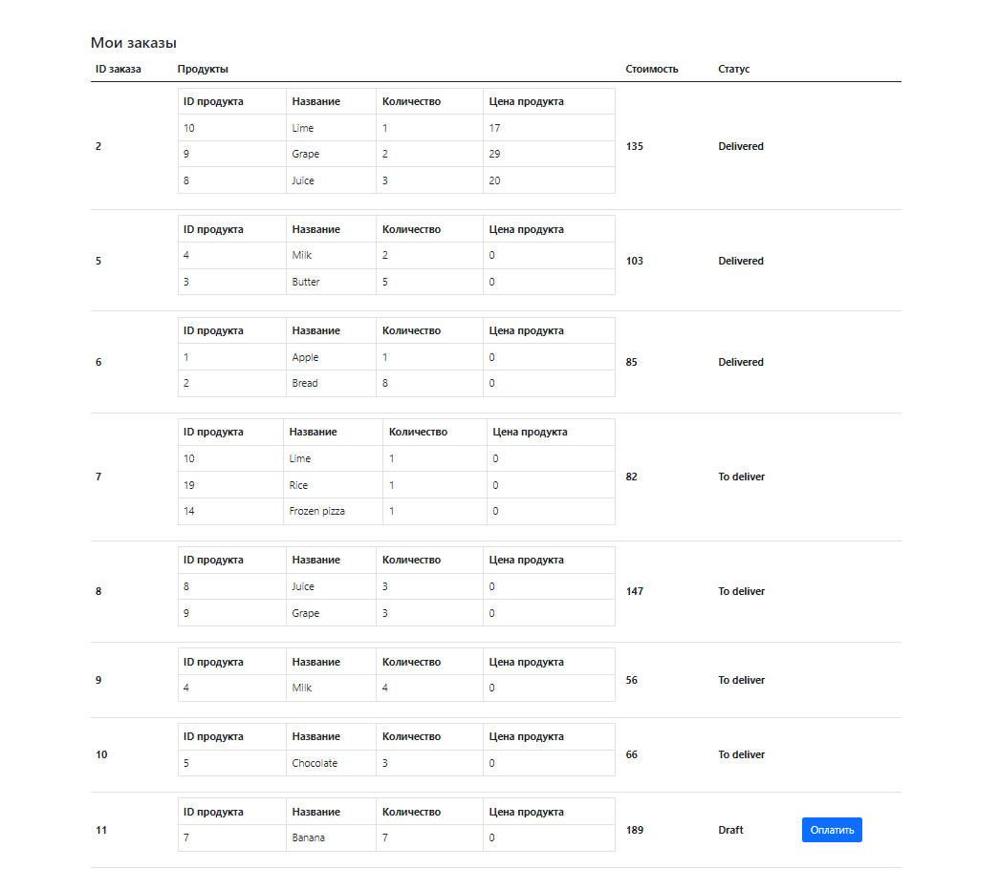

<h1>Internet Market 1.0</h1>

Реализовано веб-приложение - интернет магазин:
<ol>
<li>Backend: Java 11, Spring Boot, Microservices
</li>
<ul>
    <li>Gateway Service</li>
        <ul>
            <li>Spring Cloud</li>
        </ul>
    <li>Authentication Service</li>
        <ul>
            <li>Spring Boot(Security, JPA), JWT, JDBC, MySql </li>
        </ul>
    <li>Cart Service</li>
        <ul>
            <li>Spring Boot (Data, JPA), Spring Data, Redis</li>
        </ul>
    <li>Core Service</li>
        <ul>
            <li>Spring Boot (Data, JPA), JDBC, MySql</li>
        </ul>
</ul>
<li>Frontend: Front-Service </li>
    <ul>
        <li>HTML, AngularJS</li>
    </ul>
</ol>
<h3>Функционал:</h3>
<ol>

<li>Авторизация по логину и паролю</li>
<li>Каталог товаров</li>
<li>Каталог товаров</li>
<li>Поиск товара по названию</li>
<li>Фильтр по минимальной, максимальной цене</li>
<li>Корзина</li>
<li>Оформление заказов</li>
<li>Оплата (Интеграция с PayPal)</li>
<li>Просмотр истории заказов</li>
</ol>

